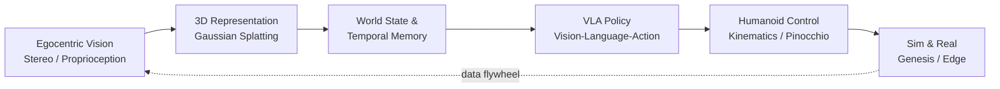

<!-- Replace every USERNAME with your GitHub username -->

<h1 align="center">Nguyen The Cong</h1>

  

  <b>AI Engineer</b> building the bridge between <b>foundation models</b> and <b>embodied systems</b>. 
  I care about the full stack: perception, 3D representation, policy learning, and the distributed infrastructure that makes it run in real time.

  
  
  
  

---

## 🎯 Focus

| Area | What I work on |
|---|---|
| 🤖 **Humanoid & Physical AI** | Egocentric perception for humanoid manipulation, kinematics-aware vision, sim-to-real data generation |
| 🧠 **VLA & Multimodal** | Vision-Language-Action pipelines, multimodal retrieval (SigLIP / OpenCLIP), speech + vision + language systems |
| ⚙️ **Systems** | Real-time inference serving, streaming pipelines, distributed data infrastructure, edge deployment |

---

## 🔬 Featured Work

### 🦾 SelfBodyGS — Egocentric 3D Vision for Humanoid Manipulation
*VinDynamics · 2026*
- Designed a **feed-forward 3D Gaussian Splatting** framework that resolves dynamic **egocentric self-occlusion** in humanoid manipulation via real-time **proprioceptive conditioning**.
- Built a sub-millisecond **Pinocchio-based GPU rasterization** pipeline that produces kinematic visibility fields aligned with head stereo vision, reaching **IoU ≥ 0.98** against simulator ground truth.
- Created the **HEO (Humanoid Egocentric Occlusion) benchmark** with multi-trajectory manipulation sequences in **Genesis Sim**, plus a **temporal Gaussian memory** to reconstruct occluded workspaces.
- Trained custom detection models on an RTX 6000 Ada (AMP/FP16) and exported through **ONNX / ONNX-Slim** for edge deployment.

`PyTorch` `gsplat` `Pinocchio` `Genesis` `OpenCV` `ONNX`

### 🎙️ Real-Time Voice Infrastructure
*Taureau AI · Apr–Jun 2026*
- Decoupled transport from business logic using **WebRTC (UDP/PCM)** and **WebSockets** for resilient bi-directional streaming with interruption handling.
- Scaled LLM serving with **vLLM** (PagedAttention, continuous batching) to cut Time-to-First-Byte.
- Integrated streaming **Whisper** ASR with dynamic VAD and an async **TTS** module for concurrent token-to-speech synthesis.
- Built async **multi-agent RAG** pipelines (FastAPI, Celery, Redis, LangGraph) with strict Pydantic validation and Qdrant upserts.

`vLLM` `Whisper` `WebRTC` `FastAPI` `LangGraph` `Qdrant`

### 🗣️ Speech Intelligence & Code-Switching
*VALSEA · Singapore (Remote) · 2026*
- Researched and integrated a **Hybrid Language-ID module** alongside core ASR to resolve acoustic ambiguity in heavy code-switching (Singlish, Vietnamese-English).
- Integrated an enterprise ASR **post-correction layer** with immutable vocabulary snapshots, atomic CAS publication, and fail-closed tenant authorization.
- Designed **differentiable, attention-guided correction layers** that penalize phoneme/token confusion to reduce WER on noisy streaming audio.

### 🚗 CRAV-14 — Autonomous Driving Scene Search
*AI in Action, VinUniversity · Aug 2026*
- Multimodal indexing platform for large AV video datasets with **natural-language scene search**.
- GPU-accelerated keyframe embedding (**SigLIP / OpenCLIP**), hybrid vector + metadata retrieval in **Qdrant**, and **LangGraph** agents translating queries into structured searches.

### 🏦 RegWatch — Hybrid Knowledge RAG for Compliance
*Hack CX in Banking Together · Top 24 Finalist*
- Combined **Neo4j** (entity-relationship graphs) with **Qdrant** (semantic retrieval) and deterministic **LangGraph** reasoning for multi-step legal analysis, deployed on **AWS / Kubernetes**.

### 🏗️ Open-Source Lakehouse Platform
*Team Lead · Dataflow 2026 · Top 10 Finalist*
- Distributed pipeline over **590K+ records** with **Spark + Iceberg** (ACID, time-travel) and a **ClickHouse** low-latency serving layer with one-command deployment.

---

## 🛠️ Tech Stack

  

| Domain | Tools |
|---|---|
| **Embodied AI & 3D Vision** | PyTorch, 3D Gaussian Splatting (gsplat), Pinocchio, Genesis Sim, OpenCV, ONNX |
| **Multimodal & LLM** | vLLM, Whisper, SigLIP / OpenCLIP, LangGraph, RAG |
| **Data & Infra** | Docker, Kubernetes, Celery, Redis, Apache Spark / Iceberg, MinIO, Qdrant, Neo4j, ClickHouse |
| **Backend & Realtime** | FastAPI, WebSockets, WebRTC, CI/CD |

---

## 🏆 Recognition

- 🥇 **Top 10 Finalist** — Dataflow 2026 (HAMIC HUS)
- 🥇 **Top 24 Finalist** — Hack CX in Banking Together 2026 (HUST)
- 🥇 **Top 30 Finalist** — RMIT Business Analytics Champions 2025
- 🌏 **Top 10 Global Finalist** — Highschool Business Case Competition 2024

## 🎓 Education

**VNU University of Engineering and Technology (UET-VNU)** — B.Sc. Information Systems · GPA 3.3/4.0 · IELTS 7.5

---

## 🌱 Currently

- Pushing egocentric 3D perception toward **VLA policies** for humanoid manipulation
- Exploring **world models** and temporal memory for long-horizon physical tasks
- Making multimodal inference **faster and cheaper** on edge hardware

  <i>"If it can't run in real time on real hardware, it's still a demo."</i>

  

